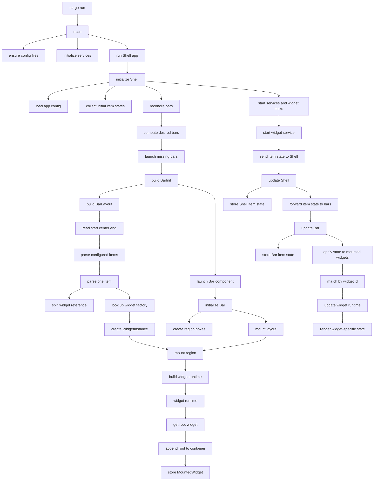
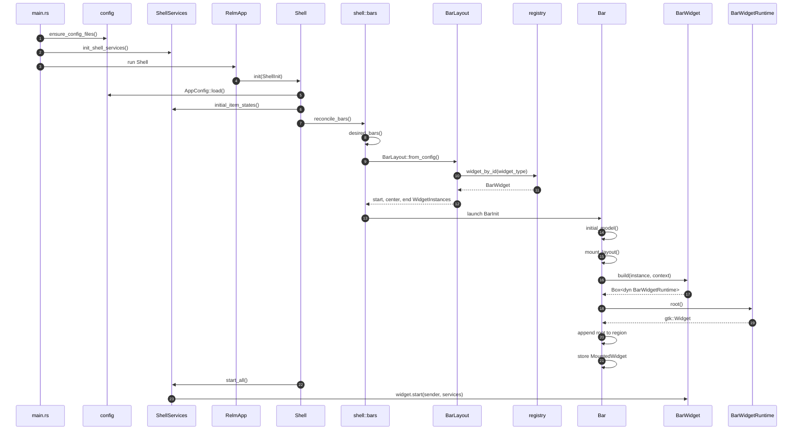
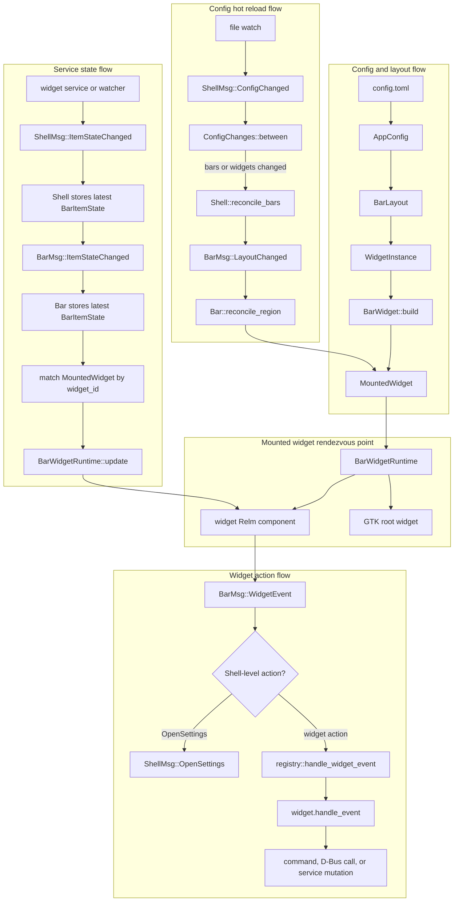

# Bar Widget Lifecycle

This document traces how Wayward turns `config.toml` into mounted bar widgets, then how widget state and widget actions move through the running application.

There are two related flows:

- Startup and creation: config is resolved into `WidgetInstance`s, then each widget factory builds a mounted runtime.
- Ongoing messages: services send state into mounted runtimes, and widgets send actions back out to services or shell-level handlers.

## High-Level Lifecycle

## Startup Sequence

## Ongoing Workflow

## Important Types

`BarWidget` is the static widget definition. It knows the widget id, how to build a runtime, how to provide an initial state, how to start background work, and how to handle widget events.

`WidgetInstance` is a config-resolved widget entry. It contains the configured id, widget type, optional instance name, resolved config table, and the registered `BarWidget`.

`BarWidgetRuntime` is the live handle returned by `BarWidget::build`. The bar stores this in `MountedWidget` and uses it to get the GTK root and push state updates into the widget.

`MountedWidget` is the point where creation flow and message flow meet. It stores the `WidgetInstance`, the widget id, the bar region, and the live runtime.

`BarItemState` is the service-to-render state envelope. Services and watchers send it to `Shell` with `ShellMsg::ItemStateChanged`.

`WidgetAction` is the widget-to-service command envelope. It is split into domain-specific action enums such as `VolumeAction`, `BrightnessAction`, and `NotificationAction`.

## Key Handoff Points

- `main.rs` initializes config files, services, CSS, and the Relm app.
- `Shell` owns which bar windows exist and forwards item state to each running bar.
- `shell::bars` reconciles configured bars against available monitors.
- `BarLayout` translates config strings into `WidgetInstance`s.
- `registry::widget_by_id` turns a widget id like `clock` into a registered widget factory.
- `Bar::mount_region` builds widget runtimes and appends their GTK roots into the start, center, or end container.
- `ShellMsg::ItemStateChanged` is the service-to-shell state path.
- `BarMsg::ItemStateChanged` is the shell-to-bar state path.
- `BarWidgetRuntime::update` is the bar-to-widget render update path.
- `BarMsg::WidgetEvent` is the widget-to-bar action path.
- `registry::handle_widget_event` routes widget actions back to the owning widget module.
