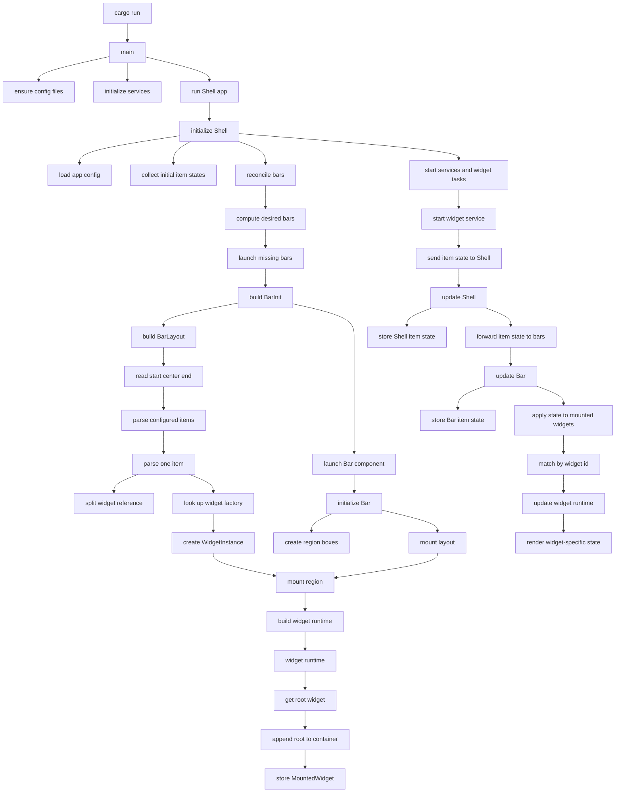

# Bar Widget Lifecycle

This diagram traces how `cargo run` turns app config into rendered bar widgets, then how service state reaches those mounted widgets after startup.

## Key Handoff Points

- `Shell` owns which bar windows exist.
- `BarLayout` translates config strings into `WidgetInstance`s.
- `registry::widget_by_id` turns a widget id like `clock` into a registered widget factory.
- `Bar::mount_region` is where widget factories are built and appended into GTK containers.
- `ShellMsg::ItemStateChanged` is the service-to-shell state path.
- `BarMsg::ItemStateChanged` is the shell-to-bar state path.
- `BarWidgetRuntime::update` is the bar-to-widget render-update path.
